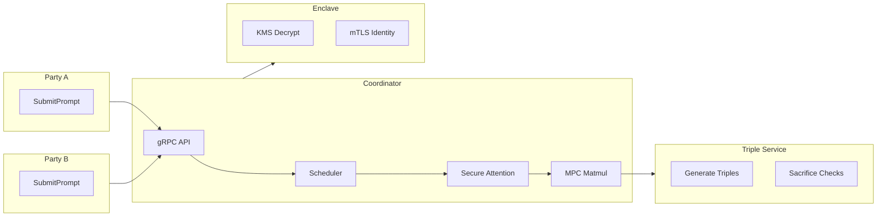
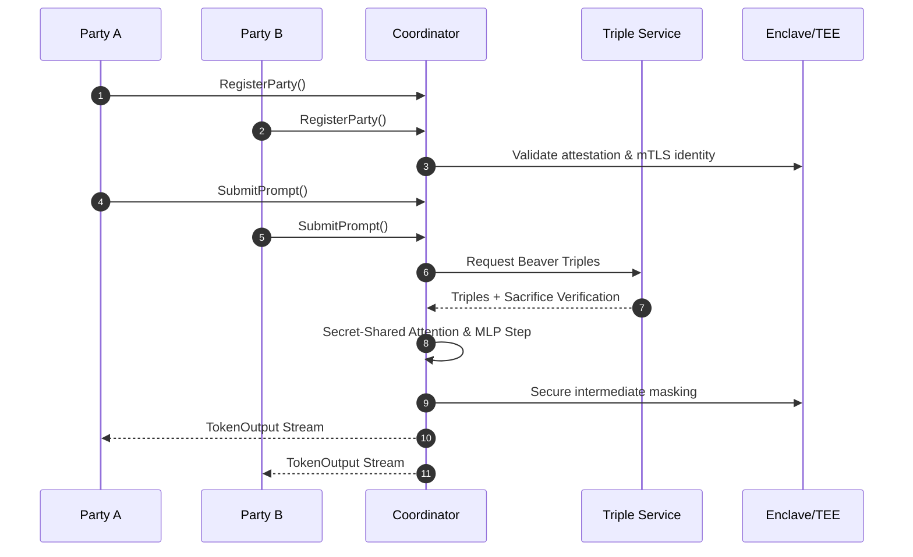

# MPC-Prompt: Confidential Federated Autoregressive Inference

<!-- Badges -->

## Overview
MPC-Prompt is a proof-of-concept framework enabling multiple mutually distrustful
parties to jointly run autoregressive (AR) inference using a shared Transformer model
without revealing private inputs or weights.

## Architecture Diagram

## System Sequence Diagram

## Production Use Warnings
⚠️ This is a research PoC and is **not production-secure**.  
Additional hardening, side‑channel mitigation, attestation policy enforcement,
constant‑time kernels, and supply‑chain controls are required.

## How It Works
- Secret sharing and MPC are used for all attention, MLP, and projection computations.
- Secure matmul uses Beaver triples with MACed shares (SPDZ).
- Exponential is approximated with Chebyshev minimax polynomial to avoid leakage.
- All transport is protected with mTLS or WireGuard; enclaves bind identity to attestation.
- Only the final predicted token is revealed; KV cache remains secret-shared.

## Security & Operation Notes (PoC)
- MPC math is correct but not formally malicious‑secure.
- No padding to hide sequence length.
- Attestation uses placeholders; no SEV‑SNP/TDX verifier SDK in PoC.
- Containers use non‑root users but not full AppArmor/Seccomp confinement.
- Timing uniformity tests exist but kernel is not fully constant-time.

## Hardening Needed for Production
1. Constant-time C or WASM kernels for all MPC ops.
2. Real SEV‑SNP/TDX verification + attestation-bound mTLS identity.
3. DP/noise or padding to hide length information.
4. SLSA-compliant CI, signed images, SBOM generation.
5. WireGuard key rotation + certificate revocation.
6. Encrypted FS for enclave-side model + config.

## Tunables
| Setting | Description |
|--------|-------------|
| tls.enabled | Enable TLS/mTLS |
| fixed_point.scale_bits | MPC precision |
| cheby.deg | Approximation degree |
| scheduler.max_context | Max secret-shared context |
| triple_pool.min_size | Triple regen threshold |
| topk | Sampling control |

## Deployment Targets
- Docker Compose (local simulation)
- AWS Nitro Enclaves (via EIF build)
- OCI Confidential VM
- Torrents
- Ethereum
- Bitcoin
- Kubernetes (future)
